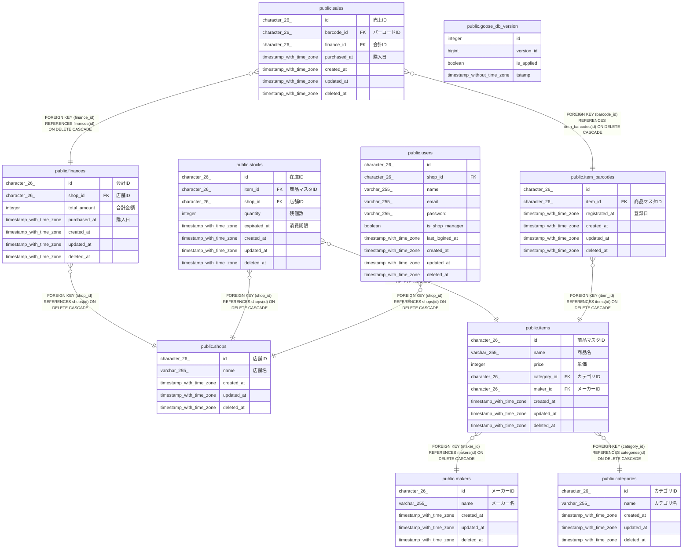

# postgres

## Tables

| Name                                                  | Columns | Comment | Type       |
| ----------------------------------------------------- | ------- | ------- | ---------- |
| [public.goose_db_version](public.goose_db_version.md) | 4       |         | BASE TABLE |
| [public.shops](public.shops.md)                       | 5       |         | BASE TABLE |
| [public.users](public.users.md)                       | 10      |         | BASE TABLE |
| [public.makers](public.makers.md)                     | 5       |         | BASE TABLE |
| [public.categories](public.categories.md)             | 5       |         | BASE TABLE |
| [public.items](public.items.md)                       | 8       |         | BASE TABLE |
| [public.item_barcodes](public.item_barcodes.md)       | 6       |         | BASE TABLE |
| [public.stocks](public.stocks.md)                     | 8       |         | BASE TABLE |
| [public.finances](public.finances.md)                 | 7       |         | BASE TABLE |
| [public.sales](public.sales.md)                       | 7       |         | BASE TABLE |

## Relations

---

> Generated by [tbls](https://github.com/k1LoW/tbls)
