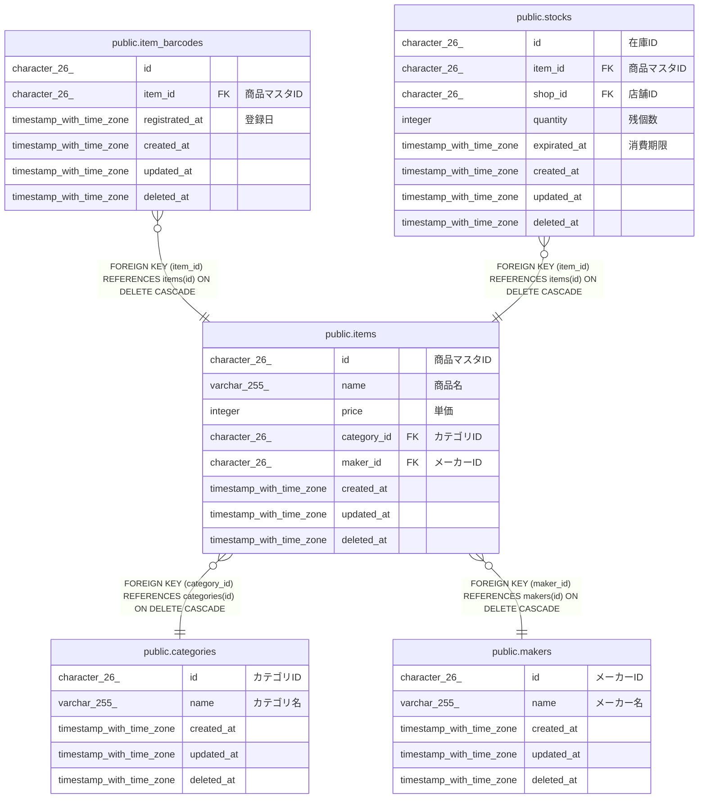

# public.categories

## Description

## Columns

| Name       | Type                     | Default           | Nullable | Children                        | Comment    |
| ---------- | ------------------------ | ----------------- | -------- | ------------------------------- | ---------- |
| id         | character(26)            |                   | false    | [public.items](public.items.md) | カテゴリID     |
| name       | varchar(255)             |                   | false    |                                 | カテゴリ名      |
| created_at | timestamp with time zone | CURRENT_TIMESTAMP | false    |                                 |            |
| updated_at | timestamp with time zone | CURRENT_TIMESTAMP | false    |                                 |            |
| deleted_at | timestamp with time zone |                   | true     |                                 |            |

## Constraints

| Name                | Type        | Definition       |
| ------------------- | ----------- | ---------------- |
| categories_pkey     | PRIMARY KEY | PRIMARY KEY (id) |
| categories_name_key | UNIQUE      | UNIQUE (name)    |

## Indexes

| Name                      | Definition                                                                           |
| ------------------------- | ------------------------------------------------------------------------------------ |
| categories_pkey           | CREATE UNIQUE INDEX categories_pkey ON public.categories USING btree (id)            |
| categories_name_key       | CREATE UNIQUE INDEX categories_name_key ON public.categories USING btree (name)      |
| idx_categories_created_at | CREATE INDEX idx_categories_created_at ON public.categories USING btree (created_at) |

## Relations

---

> Generated by [tbls](https://github.com/k1LoW/tbls)
