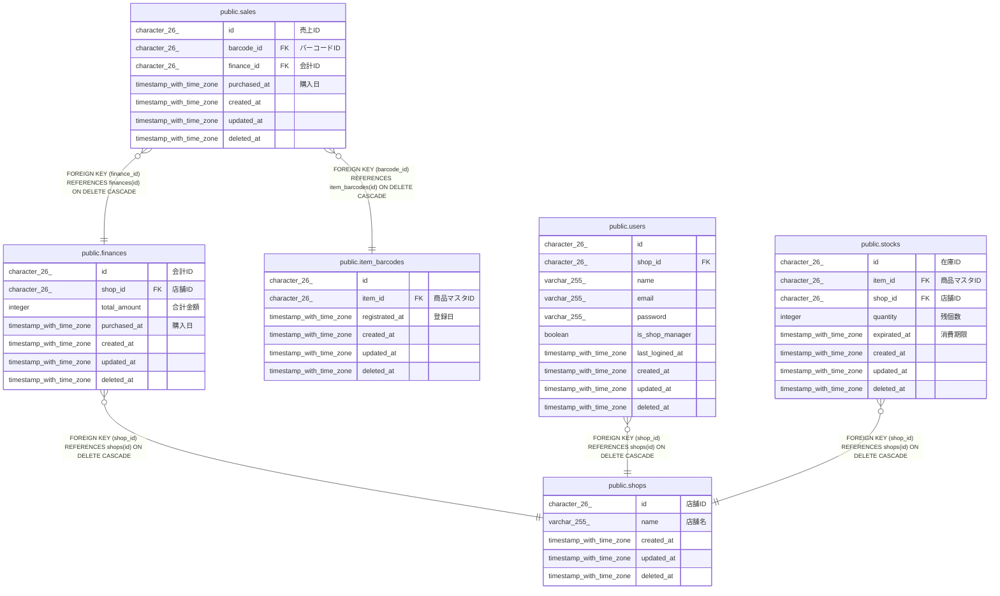

# public.finances

## Description

## Columns

| Name         | Type                     | Default           | Nullable | Children                        | Parents                         | Comment  |
| ------------ | ------------------------ | ----------------- | -------- | ------------------------------- | ------------------------------- | -------- |
| id           | character(26)            |                   | false    | [public.sales](public.sales.md) |                                 | 会計ID     |
| shop_id      | character(26)            |                   | false    |                                 | [public.shops](public.shops.md) | 店舗ID     |
| total_amount | integer                  |                   | false    |                                 |                                 | 合計金額     |
| purchased_at | timestamp with time zone |                   | false    |                                 |                                 | 購入日      |
| created_at   | timestamp with time zone | CURRENT_TIMESTAMP | false    |                                 |                                 |          |
| updated_at   | timestamp with time zone | CURRENT_TIMESTAMP | false    |                                 |                                 |          |
| deleted_at   | timestamp with time zone |                   | true     |                                 |                                 |          |

## Constraints

| Name                  | Type        | Definition                                                   |
| --------------------- | ----------- | ------------------------------------------------------------ |
| finances_shop_id_fkey | FOREIGN KEY | FOREIGN KEY (shop_id) REFERENCES shops(id) ON DELETE CASCADE |
| finances_pkey         | PRIMARY KEY | PRIMARY KEY (id)                                             |

## Indexes

| Name                    | Definition                                                                       |
| ----------------------- | -------------------------------------------------------------------------------- |
| finances_pkey           | CREATE UNIQUE INDEX finances_pkey ON public.finances USING btree (id)            |
| idx_finances_created_at | CREATE INDEX idx_finances_created_at ON public.finances USING btree (created_at) |

## Relations

---

> Generated by [tbls](https://github.com/k1LoW/tbls)
