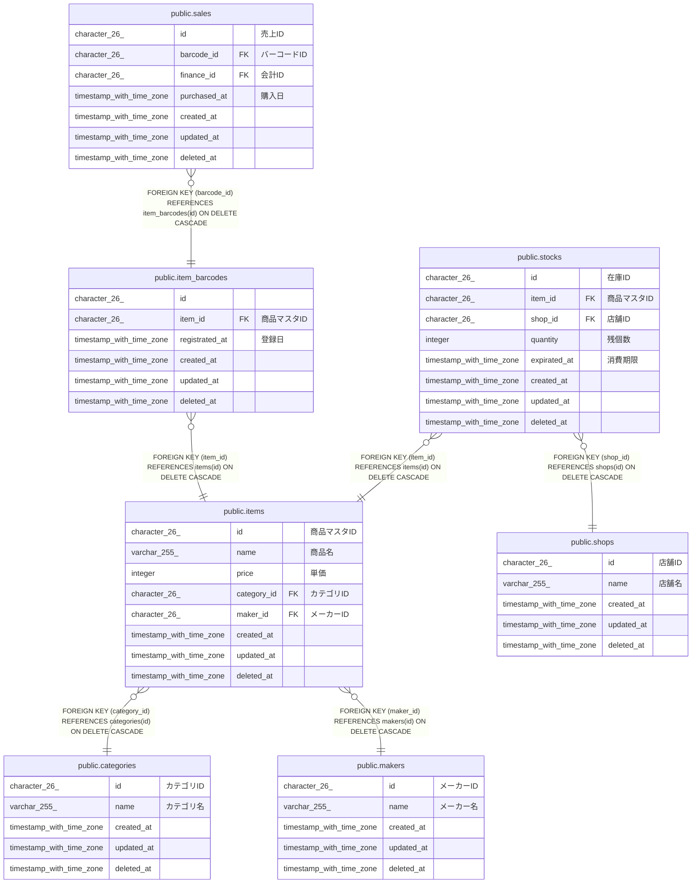

# public.items

## Description

## Columns

| Name        | Type                     | Default           | Nullable | Children                                                                          | Parents                                   | Comment      |
| ----------- | ------------------------ | ----------------- | -------- | --------------------------------------------------------------------------------- | ----------------------------------------- | ------------ |
| id          | character(26)            |                   | false    | [public.item_barcodes](public.item_barcodes.md) [public.stocks](public.stocks.md) |                                           | 商品マスタID      |
| name        | varchar(255)             |                   | false    |                                                                                   |                                           | 商品名          |
| price       | integer                  |                   | false    |                                                                                   |                                           | 単価           |
| category_id | character(26)            |                   | false    |                                                                                   | [public.categories](public.categories.md) | カテゴリID       |
| maker_id    | character(26)            |                   | false    |                                                                                   | [public.makers](public.makers.md)         | メーカーID       |
| created_at  | timestamp with time zone | CURRENT_TIMESTAMP | false    |                                                                                   |                                           |              |
| updated_at  | timestamp with time zone | CURRENT_TIMESTAMP | false    |                                                                                   |                                           |              |
| deleted_at  | timestamp with time zone |                   | true     |                                                                                   |                                           |              |

## Constraints

| Name                    | Type        | Definition                                                            |
| ----------------------- | ----------- | --------------------------------------------------------------------- |
| items_maker_id_fkey     | FOREIGN KEY | FOREIGN KEY (maker_id) REFERENCES makers(id) ON DELETE CASCADE        |
| items_category_id_fkey  | FOREIGN KEY | FOREIGN KEY (category_id) REFERENCES categories(id) ON DELETE CASCADE |
| items_pkey              | PRIMARY KEY | PRIMARY KEY (id)                                                      |
| items_name_key          | UNIQUE      | UNIQUE (name)                                                         |
| items_name_maker_id_key | UNIQUE      | UNIQUE (name, maker_id)                                               |

## Indexes

| Name                    | Definition                                                                               |
| ----------------------- | ---------------------------------------------------------------------------------------- |
| items_pkey              | CREATE UNIQUE INDEX items_pkey ON public.items USING btree (id)                          |
| items_name_key          | CREATE UNIQUE INDEX items_name_key ON public.items USING btree (name)                    |
| items_name_maker_id_key | CREATE UNIQUE INDEX items_name_maker_id_key ON public.items USING btree (name, maker_id) |
| idx_items_created_at    | CREATE INDEX idx_items_created_at ON public.items USING btree (created_at)               |

## Relations

---

> Generated by [tbls](https://github.com/k1LoW/tbls)
