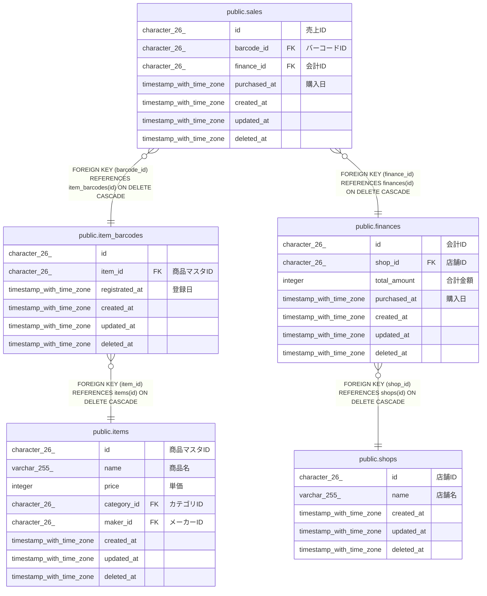

# public.sales

## Description

## Columns

| Name         | Type                     | Default           | Nullable | Parents                                         | Comment      |
| ------------ | ------------------------ | ----------------- | -------- | ----------------------------------------------- | ------------ |
| id           | character(26)            |                   | false    |                                                 | 売上ID         |
| barcode_id   | character(26)            |                   | false    | [public.item_barcodes](public.item_barcodes.md) | バーコードID      |
| finance_id   | character(26)            |                   | false    | [public.finances](public.finances.md)           | 会計ID         |
| purchased_at | timestamp with time zone |                   | false    |                                                 | 購入日          |
| created_at   | timestamp with time zone | CURRENT_TIMESTAMP | false    |                                                 |              |
| updated_at   | timestamp with time zone | CURRENT_TIMESTAMP | false    |                                                 |              |
| deleted_at   | timestamp with time zone |                   | true     |                                                 |              |

## Constraints

| Name                  | Type        | Definition                                                              |
| --------------------- | ----------- | ----------------------------------------------------------------------- |
| sales_barcode_id_fkey | FOREIGN KEY | FOREIGN KEY (barcode_id) REFERENCES item_barcodes(id) ON DELETE CASCADE |
| sales_finance_id_fkey | FOREIGN KEY | FOREIGN KEY (finance_id) REFERENCES finances(id) ON DELETE CASCADE      |
| sales_pkey            | PRIMARY KEY | PRIMARY KEY (id)                                                        |

## Indexes

| Name                 | Definition                                                                 |
| -------------------- | -------------------------------------------------------------------------- |
| sales_pkey           | CREATE UNIQUE INDEX sales_pkey ON public.sales USING btree (id)            |
| idx_sales_created_at | CREATE INDEX idx_sales_created_at ON public.sales USING btree (created_at) |

## Relations

---

> Generated by [tbls](https://github.com/k1LoW/tbls)
