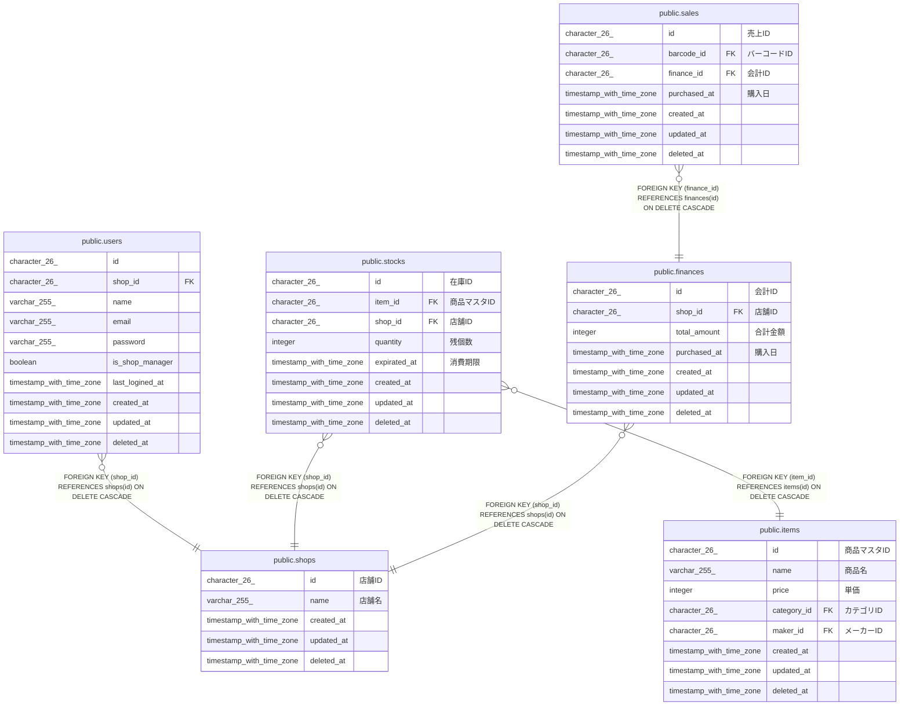

# public.shops

## Description

## Columns

| Name       | Type                     | Default           | Nullable | Children                                                                                                | Comment |
| ---------- | ------------------------ | ----------------- | -------- | ------------------------------------------------------------------------------------------------------- | ------- |
| id         | character(26)            |                   | false    | [public.users](public.users.md) [public.stocks](public.stocks.md) [public.finances](public.finances.md) | 店舗ID    |
| name       | varchar(255)             |                   | false    |                                                                                                         | 店舗名     |
| created_at | timestamp with time zone | CURRENT_TIMESTAMP | false    |                                                                                                         |         |
| updated_at | timestamp with time zone | CURRENT_TIMESTAMP | false    |                                                                                                         |         |
| deleted_at | timestamp with time zone |                   | true     |                                                                                                         |         |

## Constraints

| Name           | Type        | Definition       |
| -------------- | ----------- | ---------------- |
| shops_pkey     | PRIMARY KEY | PRIMARY KEY (id) |
| shops_name_key | UNIQUE      | UNIQUE (name)    |

## Indexes

| Name                 | Definition                                                                 |
| -------------------- | -------------------------------------------------------------------------- |
| shops_pkey           | CREATE UNIQUE INDEX shops_pkey ON public.shops USING btree (id)            |
| shops_name_key       | CREATE UNIQUE INDEX shops_name_key ON public.shops USING btree (name)      |
| idx_shops_created_at | CREATE INDEX idx_shops_created_at ON public.shops USING btree (created_at) |

## Relations

---

> Generated by [tbls](https://github.com/k1LoW/tbls)
