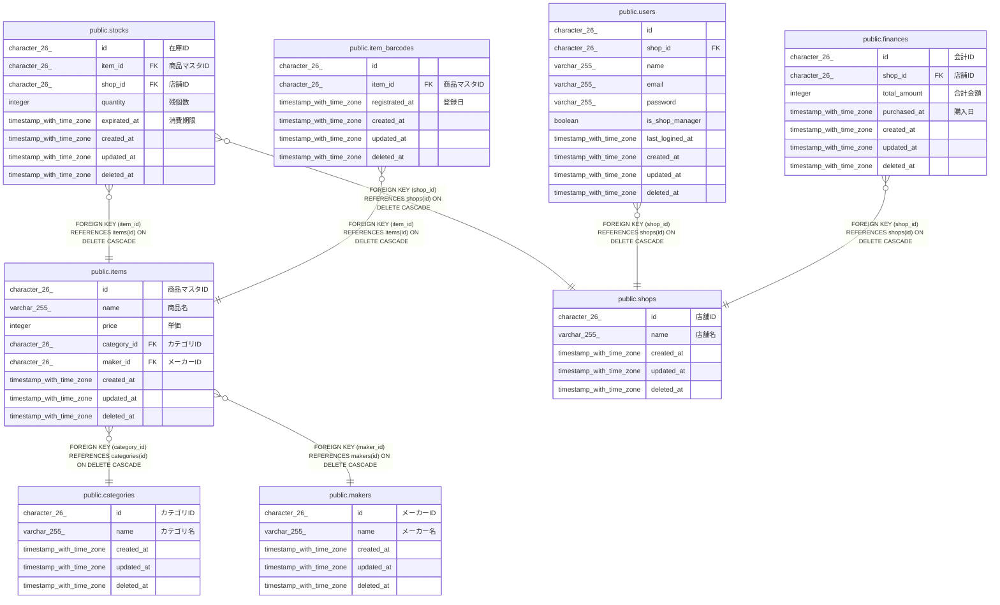

# public.stocks

## Description

## Columns

| Name         | Type                     | Default           | Nullable | Parents                         | Comment      |
| ------------ | ------------------------ | ----------------- | -------- | ------------------------------- | ------------ |
| id           | character(26)            |                   | false    |                                 | 在庫ID         |
| item_id      | character(26)            |                   | false    | [public.items](public.items.md) | 商品マスタID      |
| shop_id      | character(26)            |                   | false    | [public.shops](public.shops.md) | 店舗ID         |
| quantity     | integer                  |                   | false    |                                 | 残個数          |
| expirated_at | timestamp with time zone |                   | true     |                                 | 消費期限         |
| created_at   | timestamp with time zone | CURRENT_TIMESTAMP | false    |                                 |              |
| updated_at   | timestamp with time zone | CURRENT_TIMESTAMP | false    |                                 |              |
| deleted_at   | timestamp with time zone |                   | true     |                                 |              |

## Constraints

| Name                | Type        | Definition                                                   |
| ------------------- | ----------- | ------------------------------------------------------------ |
| stocks_shop_id_fkey | FOREIGN KEY | FOREIGN KEY (shop_id) REFERENCES shops(id) ON DELETE CASCADE |
| stocks_item_id_fkey | FOREIGN KEY | FOREIGN KEY (item_id) REFERENCES items(id) ON DELETE CASCADE |
| stocks_pkey         | PRIMARY KEY | PRIMARY KEY (id)                                             |

## Indexes

| Name                    | Definition                                                                       |
| ----------------------- | -------------------------------------------------------------------------------- |
| stocks_pkey             | CREATE UNIQUE INDEX stocks_pkey ON public.stocks USING btree (id)                |
| idx_stocks_created_at   | CREATE INDEX idx_stocks_created_at ON public.stocks USING btree (created_at)     |
| idx_stocks_expirated_at | CREATE INDEX idx_stocks_expirated_at ON public.stocks USING btree (expirated_at) |

## Relations

---

> Generated by [tbls](https://github.com/k1LoW/tbls)
