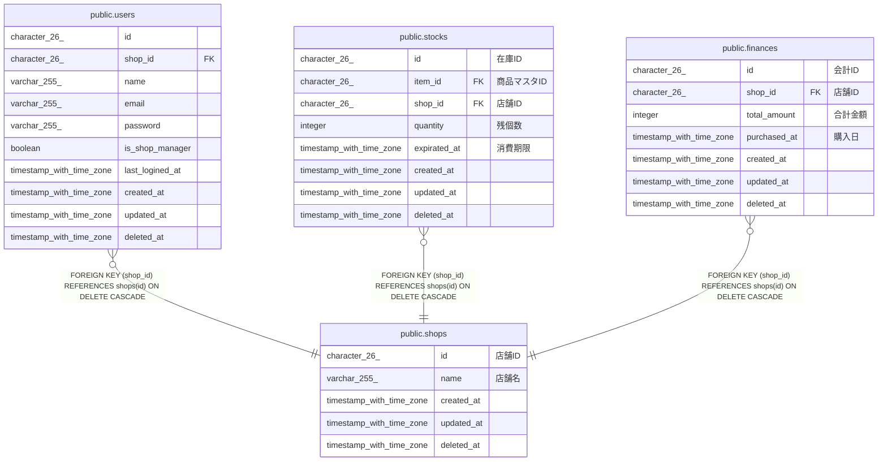

# public.users

## Description

## Columns

| Name            | Type                     | Default           | Nullable | Parents                         |
| --------------- | ------------------------ | ----------------- | -------- | ------------------------------- |
| id              | character(26)            |                   | false    |                                 |
| shop_id         | character(26)            |                   | false    | [public.shops](public.shops.md) |
| name            | varchar(255)             |                   | false    |                                 |
| email           | varchar(255)             |                   | false    |                                 |
| password        | varchar(255)             |                   | false    |                                 |
| is_shop_manager | boolean                  |                   | false    |                                 |
| last_logined_at | timestamp with time zone |                   | true     |                                 |
| created_at      | timestamp with time zone | CURRENT_TIMESTAMP | false    |                                 |
| updated_at      | timestamp with time zone | CURRENT_TIMESTAMP | false    |                                 |
| deleted_at      | timestamp with time zone |                   | true     |                                 |

## Constraints

| Name               | Type        | Definition                                                   |
| ------------------ | ----------- | ------------------------------------------------------------ |
| users_shop_id_fkey | FOREIGN KEY | FOREIGN KEY (shop_id) REFERENCES shops(id) ON DELETE CASCADE |
| users_pkey         | PRIMARY KEY | PRIMARY KEY (id)                                             |

## Indexes

| Name                 | Definition                                                                 |
| -------------------- | -------------------------------------------------------------------------- |
| users_pkey           | CREATE UNIQUE INDEX users_pkey ON public.users USING btree (id)            |
| idx_users_created_at | CREATE INDEX idx_users_created_at ON public.users USING btree (created_at) |

## Relations

---

> Generated by [tbls](https://github.com/k1LoW/tbls)
